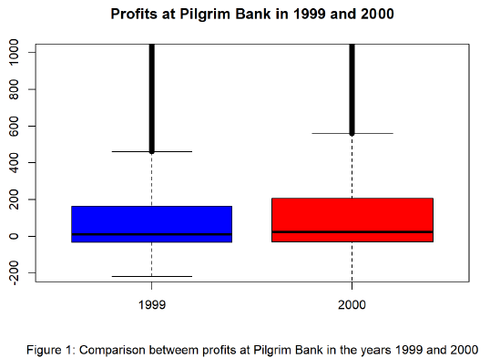

# Pilgrim Bank 
 
Pilgrim Bank A compares the profits betweew two years using a boxplot.

Pilgrim Bank B uses the machine learning techniques Logisitc Regression (glm) and Support Vector Machine (SVM) to:
   1) Determine whether having an online channel influences customer retention/profitability
   2) Determine the feasibility of predicting future retention/profitability
 

